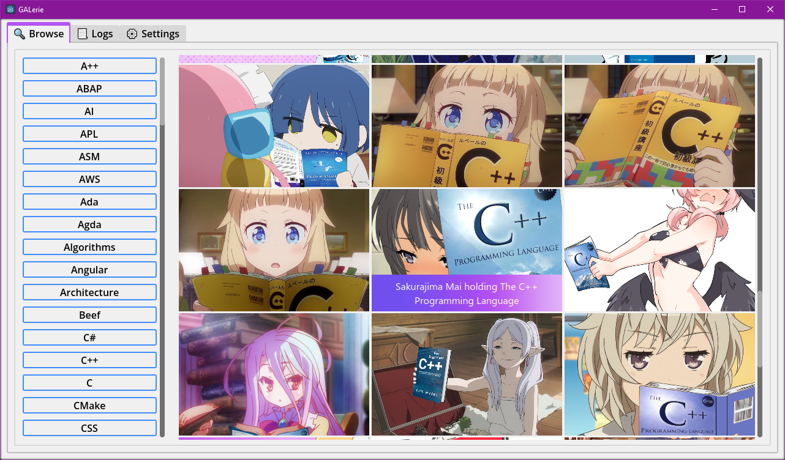
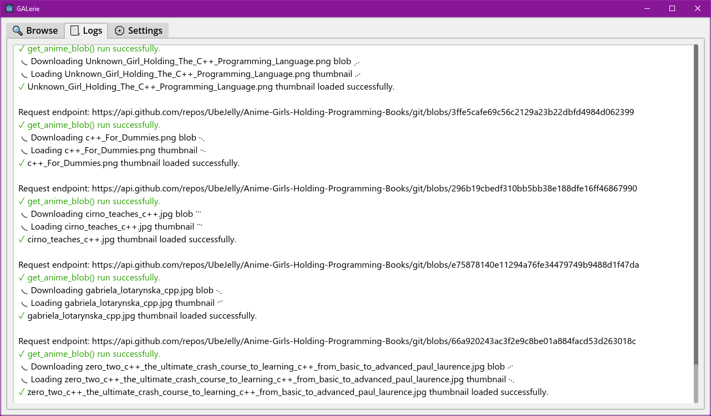

# GALerie - Gals and Programming Books Gallery

Fetches images of anime girls with programming books from https://github.com/cat-milk/Anime-Girls-Holding-Programming-Books thru Github REST API.

## Usage

You can click on a thumbnail to save the image at `~/Documents/GALerie/Anime_Girls`, and click on any languages to load its images.

### Logs

There's a `Logs` section where it keeps track of some things in the background. It also `print_rich()` on Godot's terminal but only with supported built-in effects, i.e. no custom effects.

### Settings

## Features

- [x] Browse - shows the programming books and anime girls to choose and download from.
- [x] Logs - shows the background information like request status, loading, and saving images.
- [x] Settings - shows the parameters that can be changed to affect some program functions and data.
- [x] Cache - the saved texture resources in memory are skipped from requests, so thumbnails load instantly.
- [x] Animations - hover effects on thumbnails, tooltips pop in/out, custom effects on `Logs`.
- [x] Accessibility - settings that allow most people to use the program with ease.
- [x] Rate limit - mainly for testing purposes, but can also be applied on export. (see [Testing](#testing))

### Accessibility

- Reduced motions - better known as *prefers-reduced-motion*, follows system's settings if animations are enabled or not. It overrides the `Enable animations` setting.

## Process

It basically requests the blob files through the entire repo, so we get `PackedByteArray` buffers which are then converted into readable `ImageTextures` (these are the image caches).

This means that it doesn't really download the images to any folder by default, and it will only save the images locally after you click on the thumbnails.

## Testing

Because unauthenticated requests have a rate limit of 60 requests per hour, a Personal Access Token is needed for authenticated requests which allow 5,000 requests per hour. (see [Rate limits for the REST API](https://docs.github.com/en/rest/using-the-rest-api/rate-limits-for-the-rest-api?apiVersion=2026-03-10#primary-rate-limit-for-authenticated-users))

To setup this project for testing, follow these steps:
1. Make your own fork of https://github.com/cat-milk/Anime-Girls-Holding-Programming-Books
2. Then, generate your Github Personal Access Token: https://github.com/settings/personal-access-tokens
3. Set the name, description, and expiration of your token.  
    1. Under the *Repository access* section, choose **Only select repositories** and select your fork earlier.
    2. Under the *Permissions* section, add permissions **Content** and **Metadata**
    3. Finally, generate your token. DO NOT CLOSE THE BROWSER TAB/WINDOW YET.
4. In this project's folder, add a new folder *.env*, and within it add a JSON file of any name, e.g. *auth.json*.
5. Add `{"owner":<YOUR GITHUB USERNAME>, "token":<YOUR TOKEN>}`
6. Just copy-paste your username and token to the json file, and it should be ready for *countless* testing.

> Ideally, I'd like just to pull from the original repository only to make it feel more *genuine with its purpose of fetching these images from the intended source*, but it some ways it also helps both the maintainer of the main images repository and user of this simple project.

## License
Uses MIT license. See [LICENSE.md](LICENSE.md)

Icons used for the default theme resource `toggle_off.svg` and `toggle_on.svg` are under the famicon's [MIT License](https://github.com/familyjs/famicons/blob/main/LICENSE).